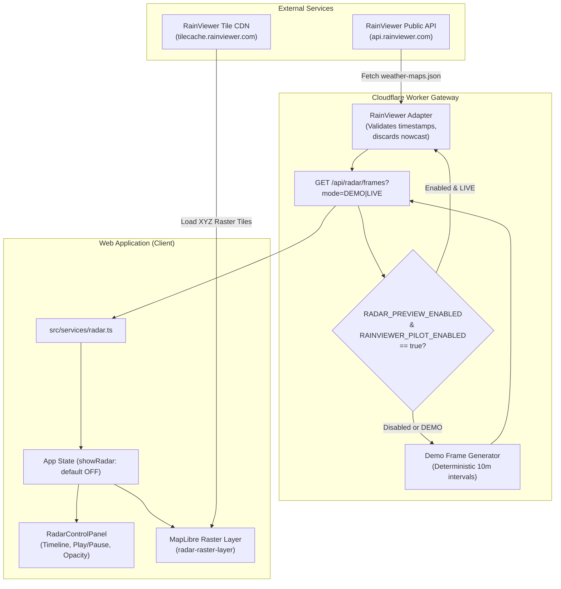

# Radar Preview Architecture (Phase 3.4)

## 1. Overview
The Radar Preview subsystem displays recent sensor-derived precipitation reflectance on the MapLibre GIS map without altering the deterministic Weather Situation question-answering pipeline or generating operational warnings.

---

## 2. Safety Controls & Invariants

1. **Classification**:
   - Radar frames are tagged strictly as `OBSERVED_REMOTE_SENSING`.
   - Never tagged as `OFFICIAL_WARNING`, `MODEL_FORECAST`, or `NOWCAST`.
2. **Default Layer State**:
   - The radar layer is **OFF by default** on initial map load.
3. **Safety Gates**:
   - `RADAR_PREVIEW_ENABLED=false`
   - `RAINVIEWER_PILOT_ENABLED=false`
   - `realDataConnected=false`
   - `operationalUseApproved=false`
4. **Strictly Forbidden in Phase 3.4**:
   - No optical flow, motion prediction, storm tracking, or extrapolation.
   - No rain arrival ETA calculation.
   - No automated storm alert generation.
5. **Attribution & Transparency**:
   - Mandatory attribution string and link rendered in control panel and MapLibre attribution container.
   - Coverage warning: `COVERAGE MAY BE INCOMPLETE` displayed prominently.
