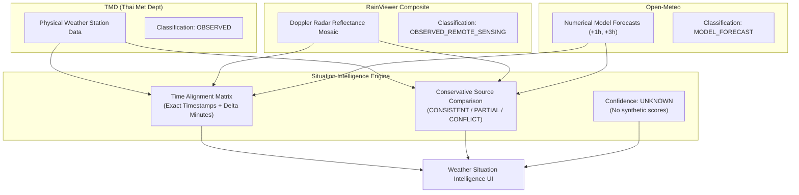

# Multi-Source Weather & Radar Intelligence (Phase 3.5)

## 1. Overview & Objectives
Phase 3.5 unifies three distinct meteorological evidence sources into a single, cohesive, and conservative Weather Intelligence preview:

1. **TMD Station Observations** → `OBSERVED` (Ground-truth physical sensor measurements)
2. **RainViewer Radar Mosaic** → `OBSERVED_REMOTE_SENSING` (Sensor-derived atmospheric reflectance)
3. **Open-Meteo Numeric Forecasts** → `MODEL_FORECAST` (Physics/AI model-based probabilistic projections)

---

## 2. Radar Governance Review & Freshness Policy
- **Review Finding**: The radar freshness thresholds (FRESH <= 30m, DELAYED <= 90m, STALE > 90m) are **INTERNAL_PREVIEW_POLICY** heuristics based on typical 10-minute scan cadences.
- **Correction**: These are explicitly documented as internal preview policies to avoid implying an official SLA from RainViewer.

---

## 3. Semantic Boundaries & Answer Logic
1. **"ตอนนี้มีฝนไหม?"**:
   - Answered strictly from `OBSERVED` station data (TMD).
   - Radar imagery serves only as supporting visual context ("ข้อมูลเรดาร์ประกอบ") and **never overrides** ground station readings.
2. **"อีก 1 ชั่วโมง / 3 ชั่วโมง มีแนวโน้มฝนไหม?"**:
   - Answered strictly from `MODEL_FORECAST` (Open-Meteo).
   - Never described as "radar predictions".
3. **Strictly Forbidden in Phase 3.5**:
   - NO optical flow or motion vector calculation.
   - NO storm tracking or extrapolation.
   - NO rain arrival ETA ("ฝนจะมาถึงในอีก X นาที").
   - NO automated warning or BCM action triggers.

---

## 4. Failure Isolation
- Independent provider failure does not cascade:
  - If TMD fails: Observed card displays UNAVAILABLE; Radar and Open-Meteo continue to render.
  - If Radar fails: Radar card displays UNAVAILABLE; TMD and Open-Meteo continue to render.
  - If Open-Meteo fails: Forecast cards display UNAVAILABLE; TMD and Radar continue to render.
