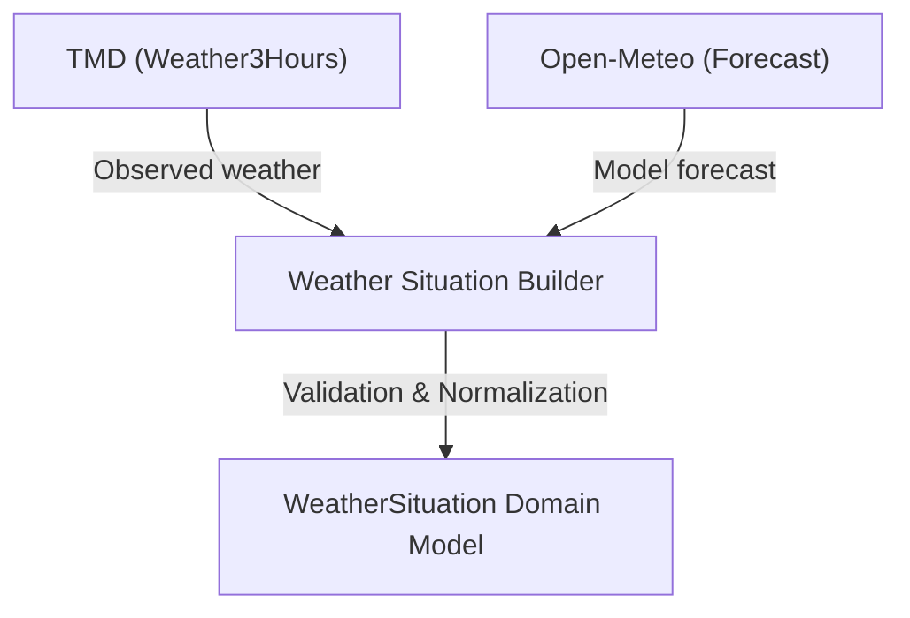

# Multi-Source Weather Situation Pipeline

The Weather Situation Pipeline aggregates meteorological intelligence from multiple upstream providers into a unified location-based status model without losing data semantics, temporal differences, or licensing boundaries.

---

## 1. Classification & Separation

To ensure decision-support integrity, the pipeline maintains strict classification rules:
- **OBSERVED**: Direct readings from meteorological instruments (TMD stations).
- **MODEL_FORECAST**: Numerical computer model outputs (Open-Meteo).
- **OFFICIAL_WARNING**: Authoritative warnings issued by TMD.

At no point does the pipeline convert a model forecast into a verified observation or warning.

---

## 2. Failure Isolation

A failure or rate limit in one provider must never cause the entire pipeline to fail. If TMD is unconfigured or fails to respond, the forecast data is still parsed and returned, and the observed section is set to `null` (and vice-versa).

---

## 3. Freshness & Conflict Rules

- **Freshness**: Managed using project states (`FRESH`, `DELAYED`, `STALE`, `UNAVAILABLE`, `UNKNOWN`). Because official freshness thresholds for combined situation outputs are pending human sign-off, they default to `UNKNOWN`.
- **Conflict**: Set to `INSUFFICIENT_DATA` since current observed hourly reading times and future hourly forecast times represent different valid timestamps and are not time-comparable.

---

## 4. Question-Answer Contracts

The pipeline exposes deterministic question-answering logic for downstream UI consumer cards:

### "ตอนนี้มีฝนไหม?" (Observed Rain)
- Checked ONLY against TMD observed precipitation.
- If unavailable/null: *"ยังไม่มีข้อมูลสังเกตการณ์ที่ยืนยันได้"*
- **Strict rule**: Forecast predictions are never used to claim current rain.

### "อีก 1–3 ชั่วโมงมีแนวโน้มฝนไหม?" (Forecast Rain)
- Checked against Open-Meteo model forecast parameters.
- Uses `precipitationProbabilityPercent` returning: *"แบบจำลองพยากรณ์คาดการณ์โอกาสเกิดฝน X%"*
- If forecast is unavailable: *"ยังไม่มีข้อมูลพยากรณ์ที่ยืนยันได้"*

---

## 5. Operational Limitations

- **No Threshold Warnings**: The pipeline does not compute warning severity levels or BCM alerts.
- **No Nowcasting**: Rain nowcasting or ETA calculations are disabled.
- **Developer Preview Only**: The internal routes remain gated behind `WEATHER_SITUATION_PIPELINE_ENABLED=false` until authorized.
