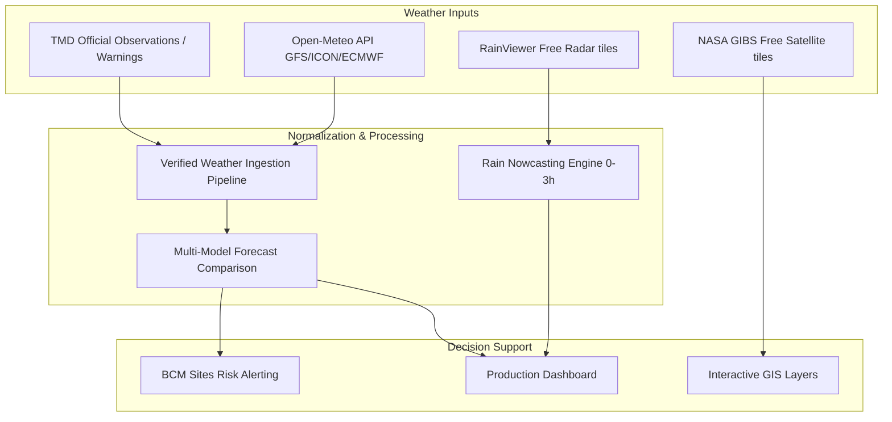

# Windy FREE Feasibility, Licensing & Architecture Audit

This document evaluates the feasibility, licensing terms, and architectural design options for using Windy in the Thailand Disaster Watch platform under a strict **ZERO-NEW-COST** constraint.

---

## 1. Executive Summary

- **Windy Premium Account vs. API**: A personal Windy Premium subscription does **not** grant API programmatic access. Programmatic integration requires a Professional API license.
- **Windy Testing API**: Windy provides a free Testing API key for development. However, **testing data is randomly shuffled or slightly modified by the server** to prevent production usage. It is strictly prohibited and scientifically useless for live disaster monitoring.
- **Cost Constraint**: Under the current zero-new-cost policy, Windy's paid Professional APIs (~990 €/year) cannot be purchased. Therefore, **Windy data cannot be integrated into the production environment**.
- **Governance Alignment**: Windy data (if utilized in the future) represents a `MODEL_FORECAST` or `NOWCAST` input. It must never override official weather forecasts or warning products issued by the Thai Meteorological Department (TMD).

---

## 2. API Capabilities & Restrictions

| API Product | Access Tier | Telemetry Data Status | Production Rights | Licensing Terms |
|---|---|---|---|---|
| **Map Forecast API** | Testing Key | Corrupted / Shuffled | `RESTRICTED` (Dev Only) | Terms of Service limit |
| **Map Forecast API** | Paid Professional | Accurate | `ALLOWED` | Professional Agreement |
| **Point Forecast API** | Testing Key | Corrupted / Shuffled | `RESTRICTED` (Dev Only) | Terms of Service limit |
| **Point Forecast API** | Paid Professional | Accurate | `ALLOWED` | Professional Agreement |
| **Radar Tiles / Animation** | Not Programmatically Available | N/A | `NOT_AVAILABLE` | No public API exists |
| **Satellite Imagery** | Not Programmatically Available | N/A | `NOT_AVAILABLE` | No public API exists |

---

## 3. Forecast Weather Models Audit

Windy aggregates upstream numerical weather prediction models. Upstream licenses apply:

- **ECMWF (IFS)**: European Centre for Medium-Range Weather Forecasts. High-resolution model. Redistributing ECMWF raw output under the Windy API requires paid Professional rights; direct redistribution is bound by ECMWF commercial licensing.
- **GFS**: Global Forecast System (NOAA). Public domain data. Programming/distribution is legally free, but Windy's API retrieval wrapper is subject to Windy pricing.
- **ICON**: German Weather Service (DWD). Open data. Programmatic use from Windy's API requires a Windy subscription.

---

## 4. Proposed Architectural Options

### Option A: Windy Testing Prototype (Development Only)
- **Scope**: Configure a local proxy route (`/api/providers/windy/weather`) in the Cloudflare Worker using a free Testing API Key.
- **Use Case**: Validate frontend weather widget rendering and multi-model forecast comparison UI layouts.
- **Safety Gate**: Active only when `WINDY_PILOT_ENABLED=true` and `NODE_ENV=development`. Strictly forbidden from production. Returns warnings that values are scrambled.

### Option B: Windy External Link (Zero-Cost Production)
- **Scope**: Instead of ingesting and mapping Windy data, the production web interface includes styled external buttons linking to the official Windy website (e.g. `https://www.windy.com/?13.75,100.50,6` centered on Thailand).
- **Use Case**: Fully compliant with Windy’s Terms of Use. Programmatically safe and requires zero API cost.

### Option C: Free/Open Production Weather Sources (Recommended)
- **Scope**: Ingest data from free, license-compliant alternatives (e.g., Open-Meteo, NOAA GFS, TMD official APIs, RainViewer, NASA GIBS) that permit free production use.

---

## 5. Conceptual Future Weather Pipeline

---

## 6. Model Comparison & Agreement Design

For future iterations (Phase 3.5), we will support calculating the level of model agreement for site-specific predictions (e.g., comparing Open-Meteo GFS/ICON forecasts to TMD official statements):

$$\text{Model Agreement} = \frac{\text{Number of Agreeing Models}}{\text{Total Models Tested}} \times 100\%$$

- **High agreement** ($\ge 75\%$): Forecast is stable and reliable for decision-support triggers.
- **Medium agreement** ($50\% - 74\%$): Forecast has slight deviation in wind/rain volume thresholds.
- **Low agreement** ($< 50\%$): Models diverge heavily. BCM decisions should rely strictly on official TMD warnings.
